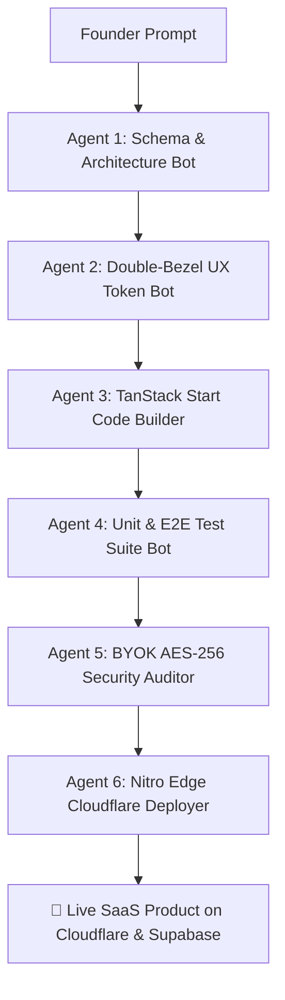

<div align="center">

# ⚡ Signhify AI Engineering Studio & SaaS Engine

### **Turn plain-English prompts into production-grade AI SaaS apps in 2-week sprints.**

*The open-source AI Product Studio engine powered by a 6-agent swarm, TanStack Start, Supabase, and client-side BYOK encryption.*

[](https://github.com/Warriorlegacy/Signhify_Studio/stargazers)
[](https://signhify.dpdns.org)
[](https://github.com/Warriorlegacy/Signhify_Studio/actions)
[](https://signhify.dpdns.org/about)
[](LICENSE)

[🌐 Visit Live Studio](https://signhify.dpdns.org) • [⚡ Generate AI Blueprint](https://signhify.dpdns.org/ai) • [📖 Read AEO Insights](https://signhify.dpdns.org/insights) • [💬 Book Call](https://signhify.dpdns.org/contact)

---

</div>

## 🔥 Why Signhify?

Traditional software agencies take **3 to 6 months** and cost **$15,000+** just to ship an MVP. 

**Signhify** changes the paradigm:
- **⚡ 2-Week Sprint Guarantee**: Go from a prompt brief to a live production web app with authentication, database models, Stripe billing, and AI pipelines.
- **🛡️ Client-Side BYOK Encryption**: Run models on your personal OpenAI, Anthropic, or custom LLM API keys safely with zero key leakage via AES-256 GCM vault encryption.
- **🤖 6-Agent Swarm**: Schema architect, UX token generator, code builder, test runner, security auditor, and edge deployment bot operating in concert.
- **💯 100% Code Ownership**: Full GitHub repository transfer from day one — no vendor lock-in.

---

## ⚡ 30-Second Quickstart

Get the full Signhify studio platform running locally in seconds:

```bash
# 1. Clone the repository
git clone https://github.com/Warriorlegacy/Signhify_Studio.git
cd Signhify_Studio

# 2. Install dependencies (bun recommended)
bun install
# or: npm install

# 3. Set environment variables
cp .env.example .env.local

# 4. Launch local dev server
bun dev
# or: npm run dev
```

Open [http://localhost:3000](http://localhost:3000) to access your local AI Studio dashboard!

---

## 🤖 The 6-Agent Autonomous Swarm



---

## 🏗️ Architecture & Technology Stack

| Layer | Component | Description |
| :--- | :--- | :--- |
| **Framework** | **React 19 + TanStack Start** | Zero-latency full-stack SSR with file-based routing |
| **Server Engine** | **Nitro + Vite 6** | Instant HMR and multi-region worker bundle generation |
| **Design System** | **TailwindCSS 4 + Framer Motion** | Doppelrand double-bezel cards & Emil Kowalski spring physics |
| **Data & Auth** | **Supabase (PostgreSQL)** | Multi-tenant user profiles, secrets vault, and RLS policies |
| **AI Gateway** | **Claude 3.5 Sonnet + GPT-4o** | Auto-fallback resilient gateway with BYOK custom endpoint support |
| **Infrastructure** | **Cloudflare Workers / Pages** | Automated DNS routing, edge functions, and static assets |
| **Payments** | **Stripe Checkout & Billing** | Subscriptions, usage-based token metering, and marketplace payouts |

---

## 💎 Engagement Tiers

| Tier | Price | Turnaround | What's Included |
| :--- | :--- | :--- | :--- |
| **🚀 Sprint** | **$299** | **5-7 Days** | Production MVP, core UI, Supabase backend, responsive mobile layout, custom domain, full GitHub transfer |
| **⚡ Studio** | **$799+** | **14 Days** | Full SaaS platform, AI agent integrations, BYOK vault, Stripe billing, admin analytics, 30 days post-launch support |
| **🏢 Enterprise** | **Custom** | **Flexible** | Multi-agent orchestration, custom LLM fine-tuning, SOC2 readiness, SLA guarantees |

---

## 🛡️ E-A-T Credentials & Trust Signals

- **Government Registration**: Registered MSME under Government of India (`UDYAM-UP-30-0081308`).
- **Headquarters**: Noida, Uttar Pradesh 201301, India.
- **Founder & Lead AI Engineer**: Piyush Raj Singh.
- **Contact & WhatsApp**: +91-6202442690
- **Email**: `Piyushrajsingh092@gmail.com`
- **Socials**: [LinkedIn](https://linkedin.com/in/piyushraj-singh) • [GitHub](https://github.com/Warriorlegacy) • [Official Brand Entity](https://signhify.dpdns.org/brand)

---

## 🌟 Show Your Support

If you find Signhify useful or want to support open-source AI tooling:

1. **Star this repository** ⭐ to help us reach GitHub Trending!
2. **Fork it** 🍴 to customize your own AI SaaS studio.
3. **Share on X/Twitter & LinkedIn** to help indie hackers build faster.

---

## 📜 License

Distributed under the **MIT License**. See [`LICENSE`](LICENSE) for details.

<div align="center">

**Built with ❤️ by Piyush Raj Singh at Signhify AI Studio**  
*Empowering founders worldwide to build the future of AI SaaS.*

</div>
