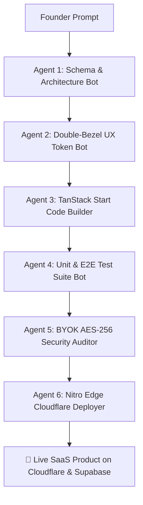

<div align="center">

# ⚡ Signhify AI Engineering Studio & SaaS Engine

### **Turn plain-English prompts into production-grade AI SaaS apps in 2-week sprints.**

*The open-source AI Product Studio engine powered by a 6-agent swarm, TanStack Start, Supabase, and client-side BYOK encryption.*

[](https://github.com/Warriorlegacy/Signhify_Studio/stargazers)
[](https://github.com/Warriorlegacy/Signhify_Studio/forks)
[](https://github.com/Warriorlegacy/Signhify_Studio/graphs/contributors)
[](https://signhify.dpdns.org)
[](https://github.com/Warriorlegacy/Signhify_Studio/actions)
[](https://github.com/Warriorlegacy/Signhify_Studio/commits/main)
[](LICENSE)
[](https://signhify.dpdns.org/about)
[](CONTRIBUTING.md)

[🌐 Visit Live Studio](https://signhify.dpdns.org) •
[⚡ Generate AI Blueprint](https://signhify.dpdns.org/ai) •
[📖 Read AEO Insights](https://signhify.dpdns.org/insights) •
[💬 Book a Call](https://signhify.dpdns.org/contact) •
[⭐ Star on GitHub](https://github.com/Warriorlegacy/Signhify_Studio/stargazers)

---

</div>

## 🎬 Try It Now

> *Describe your SaaS idea in plain English. Watch six AI agents turn it into a production-grade app in under 2 minutes.*

 <!-- TODO: Replace with actual demo GIF — record a 30s screen capture of the AI blueprint generator at work -->

| Step | What Happens | Time |
| :--- | :--- | :--- |
| **1. Describe** | Type your SaaS idea in plain English on [signhify.dpdns.org/ai](https://signhify.dpdns.org/ai) | 30s |
| **2. Agents Build** | 6-agent swarm schemas, designs, codes, tests, secures & deploys | ~90s |
| **3. You Ship** | Full GitHub transfer — you own every line | Instant |

**👉 [Try the AI Blueprint Generator Now →](https://signhify.dpdns.org/ai)** (Free, no sign-up required)

---

## 🔥 Why Signhify?

Traditional software agencies take **3 to 6 months** and cost **$15,000+** just to ship an MVP.

**Signhify changes the paradigm:**

- **⚡ 2-Week Sprint Guarantee**: Go from a prompt brief to a live production web app with authentication, database models, Stripe billing, and AI pipelines.
- **🛡️ Client-Side BYOK Encryption**: Run models on your personal OpenAI, Anthropic, or custom LLM API keys safely with zero key leakage via AES-256 GCM vault encryption.
- **🤖 6-Agent Swarm**: Schema architect, UX token generator, code builder, test runner, security auditor, and edge deployment bot operating in concert.
- **💯 100% Code Ownership**: Full GitHub repository transfer from day one — no vendor lock-in.

---

## 💡 Use Cases

| Use Case | How Signhify Helps |
| :--- | :--- |
| **🚀 Startup MVP in 2 Weeks** | Got an idea but no technical co-founder? Describe it once, get a working SaaS product with auth, billing, and a database. Iterate from there. |
| **🤖 Custom AI Agent Automation** | Need a multi-agent workflow for lead enrichment, content generation, or customer support? Signhify's swarm architecture builds custom agent pipelines with BYOK security. |
| **🏢 Internal Tool & CRM Build** | Replace Airtable, Retool, or custom spreadsheets with a proper multi-tenant web app — user roles, audit logs, Stripe subscriptions — shipped in days, not quarters. |
| **🔄 Agency White-Label Delivery** | Agency owners: drop the 6-month dev cycle. Describe the client's requirements, ship in 14 days, hand over full source code. Repeat. |

---

## 🤖 The 6-Agent Autonomous Swarm



---

## ⚡ 30-Second Quickstart

Get the full Signhify studio platform running locally in seconds:

```bash
# 1. Clone the repository
git clone https://github.com/Warriorlegacy/Signhify_Studio.git
cd Signhify_Studio

# 2. Install dependencies (bun recommended)
bun install
# or: npm install

# 3. Set environment variables
cp .env.example .env.local

# 4. Launch local dev server
bun dev
# or: npm run dev
```

Open [http://localhost:3000](http://localhost:3000) to access your local AI Studio dashboard!

---

## 🏗️ Architecture & Technology Stack

| Layer | Component | Description |
| :--- | :--- | :--- |
| **Framework** | **React 19 + TanStack Start** | Zero-latency full-stack SSR with file-based routing |
| **Server Engine** | **Nitro + Vite 6** | Instant HMR and multi-region worker bundle generation |
| **Design System** | **TailwindCSS 4 + Framer Motion** | Doppelrand double-bezel cards & Emil Kowalski spring physics |
| **Data & Auth** | **Supabase (PostgreSQL)** | Multi-tenant user profiles, secrets vault, and RLS policies |
| **AI Gateway** | **Claude 3.5 Sonnet + GPT-4o** | Auto-fallback resilient gateway with BYOK custom endpoint support |
| **Infrastructure** | **Cloudflare Workers / Pages** | Automated DNS routing, edge functions, and static assets |
| **Payments** | **Stripe Checkout & Billing** | Subscriptions, usage-based token metering, and marketplace payouts |

---

## 📊 Signhify vs Alternatives

| Feature | **Signhify** | Cursor | Lovable | v0 / Bolt |
| :--- | :--- | :--- | :--- | :--- |
| **AI Agent Swarm** | ✅ 6 agents, autonomous pipeline | ❌ Single-agent copilot | ❌ Single-agent | ❌ Single-agent |
| **BYOK Encryption** | ✅ AES-256 GCM client-side vault | ❌ No | ❌ No | ❌ No |
| **Full SaaS Scaffold** | ✅ Auth, DB, billing, RBAC | ❌ Code editor only | ⚠️ Basic frontend | ⚠️ Basic frontend |
| **2-Week Delivery SLA** | ✅ Guaranteed sprint | ❌ No | ❌ No | ❌ No |
| **Code Ownership** | ✅ 100%, full GitHub transfer | ✅ You keep code | ✅ You keep code | ✅ You keep code |
| **Pricing** | **$299–$799** flat | $20/mo per seat | $59–$249/mo | Free–$100/mo |
| **Open Source Core** | ✅ MIT License | ❌ Proprietary | ❌ Proprietary | ❌ Proprietary |
| **Multi-Agent Orchestration** | ✅ Built-in swarm | ❌ No | ❌ No | ❌ No |
| **Self-Hostable** | ✅ Yes (local dev) | ❌ Cloud only | ❌ Cloud only | ❌ Cloud only |

---

## 💎 Engagement Tiers

| Tier | Price | Turnaround | What's Included |
| :--- | :--- | :--- | :--- |
| **🚀 Sprint** | **$299** | **5–7 Days** | Production MVP, core UI, Supabase backend, responsive mobile layout, custom domain, full GitHub transfer |
| **⚡ Studio** | **$799+** | **14 Days** | Full SaaS platform, AI agent integrations, BYOK vault, Stripe billing, admin analytics, 30 days post-launch support |
| **🏢 Enterprise** | **Custom** | **Flexible** | Multi-agent orchestration, custom LLM fine-tuning, SOC2 readiness, SLA guarantees |

---

## 🛡️ E-A-T Credentials & Trust Signals

- **Government Registration**: Registered MSME under Government of India (`UDYAM-UP-30-0081308`).
- **Headquarters**: Noida, Uttar Pradesh 201301, India.
- **Founder & Lead AI Engineer**: Piyush Raj Singh.
- **Contact & WhatsApp**: +91-6202442690
- **Email**: `Piyushrajsingh092@gmail.com`
- **Socials**: [LinkedIn](https://linkedin.com/in/piyushraj-singh) • [GitHub](https://github.com/Warriorlegacy) • [Official Brand Entity](https://signhify.dpdns.org/brand)

---

## 💬 Get In Touch

| Channel | Link | Best For |
| :--- | :--- | :--- |
| **📅 Book a Call** | [signhify.dpdns.org/contact](https://signhify.dpdns.org/contact) | Project inquiries, partnership discussions |
| **💬 WhatsApp** | [+91-6202442690](https://wa.me/916202442690) | Quick questions, 24h response |
| **🐦 X / Twitter** | [@Warriorlegacy](https://x.com/Warriorlegacy) | Community updates, feature requests |
| **💼 LinkedIn** | [Piyush Raj Singh](https://linkedin.com/in/piyushraj-singh) | Professional networking, enterprise |
| **📧 Email** | Piyushrajsingh092@gmail.com | Formal proposals, partnerships |

---

## 🌟 Show Your Support

If you find Signhify useful or want to support open-source AI tooling:

| Action | Why It Helps |
| :--- | :--- |
| **⭐ Star this repo** | Pushes us toward **GitHub Trending** — the #1 way devs discover the project |
| **🍴 Fork it** | Customize your own AI SaaS studio and show what you built |
| **🐦 Share on X/Twitter** | Tag [@Warriorlegacy](https://x.com/Warriorlegacy) — we reshare every build |
| **💼 Share on LinkedIn** | Help indie hackers and founders find faster MVPs |
| **☕ Buy Me a Coffee** | [Support open-source development](#) — fuel the next feature |
| **📝 Write a Testimonial** | Drop a line at Piyushrajsingh092@gmail.com — we feature builders |

---

## ⭐ Star History

[](https://star-history.com/#Warriorlegacy/Signhify_Studio&Date)

*Track our growth on [Star History](https://star-history.com/#Warriorlegacy/Signhify_Studio) — every star funds more open-source AI features.*

---

## 🤝 Contributing

We welcome contributions! See [CONTRIBUTING.md](CONTRIBUTING.md) for:

- How the Lovable ↔ GitHub sync works
- Migration and database guidelines
- Pre-publish checklist
- First PR tips for Hacktoberfest and beyond

**Good first issues**: Look for labels like `good-first-issue`, `hacktoberfest`, and `help-wanted` in the [Issues tab](https://github.com/Warriorlegacy/Signhify_Studio/issues).

---

## 📜 License

Distributed under the **MIT License**. See [`LICENSE`](LICENSE) for details.

---

<div align="center">

**Built with ❤️ by [Piyush Raj Singh](https://github.com/Warriorlegacy) at Signhify AI Studio**  
*Empowering founders worldwide to build the future of AI SaaS.*

<br>

[](https://x.com/Warriorlegacy)
[](https://github.com/Warriorlegacy)

</div>