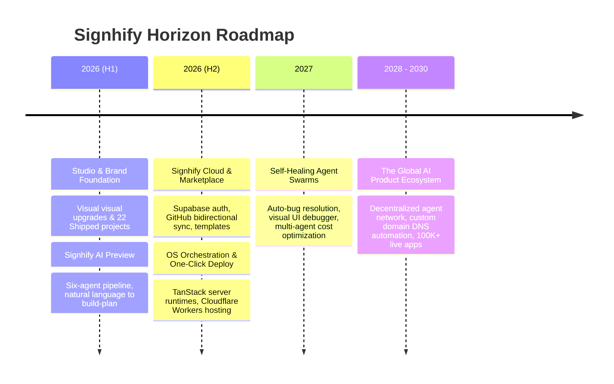

# Signhify — The Final Level Roadmap (2026 - 2030)

> **Vision**: Signhify is the ultimate AI-native product studio and operating system. We enable founders, creators, and enterprises to turn ideas into production-ready, revenue-generating software in minutes through steering autonomous agent swarms.

This is the comprehensive, multi-phase master plan to scale Signhify from an elite AI-native development studio into a global decentralized software engine.

---

## 🗺️ High-Level Horizon View



---

## 🚀 Phase 1: Studio & Brand Foundation (Completed)
**Focus**: Establishes Signhify as a trusted premium studio showcasing actual shipped builds with high-fidelity, high-aesthetic branding.

* **Milestones**:
  - [x] **22 Shipped Projects Portfolio**: Completed audit and addition of 22 real Vercel deployments (SaaS, AI automation, EdTech, Performance Marketing).
  - [x] **Premium Visual Identity**: Implemented dark cinematic theme (near-black background with electric orange glow and gold/amber accents).
  - [x] **High-Res Assets**: Generated matching premium custom hero and service banner images.
  - [x] **Lead Capture Engine**: Integrated Supabase-backed contact wizard, bookings, and WhatsApp quick action.

---

## ⚡ Phase 2: Signhify AI & Workspace OS (In Progress / Q3 2026)
**Focus**: Transitions from a static portfolio to an interactive AI playground where users get real build specs.

### 🎨 UX & Interface Architecture
* **Interface Specification**: Interactive playground route at `/ai`. Includes a large natural-language prompt area with live SSE log console.
* **Component Flow**: As the prompt begins executing, the console outputs streaming debug logs showing which agent is currently active:
  ```
  [12:04:12] AgentOrchestrator: Parsing requirements...
  [12:04:15] SchemaAgent: Designing relational models for app schema...
  [12:04:22] CodeAgent: Emitting React components with Tailwind CSS...
  ```
* **Visual States**: Glowing loading bar showing percent progress, dynamic step cards that turn green as individual agents complete their tasks.

### 💾 Data & Storage Models
```sql
-- Schema representation for AI generation runs
create table app.runs (
  id uuid primary key default gen_random_uuid(),
  user_id uuid references auth.users(id),
  prompt text not null,
  status varchar(50) not null check (status in ('pending', 'analyzing', 'generating', 'testing', 'deploying', 'completed', 'failed')),
  current_agent varchar(50),
  logs jsonb default '[]'::jsonb,
  created_at timestamp with time zone default timezone('utc'::text, now())
);

-- RLS Security Rule
alter table app.runs enable row level security;
create policy "Users can view and create their own runs" on app.runs
  for all using (auth.uid() = user_id);
```

### 🔌 API & Integration Specifications
* **SSE Endpoint**: `GET /api/ai/stream?runId=[uuid]`
  - Headers: `Content-Type: text/event-stream`, `Cache-Control: no-cache`
  - Payloads: JSON messages representing incremental code edits, agent states, and compilation percentages.
* **Execution Trigger**: `POST /api/ai/run`
  - Body: `{ prompt: string }`
  - Returns: `{ runId: uuid, status: 'pending' }`

### 🛡️ Security & Compliance Guardrails
* **Rate Limiting**: Sliding-window token bucket implemented via Redis or Supabase edge functions, allowing a maximum of 5 prompts per hour for free tier users to prevent token abuse.
* **Prompt Sanitization**: Auto-scans prompts for prompt injection attacks and excessive system instructions before passing them to the Lovable AI gateway.

---

## 📦 Phase 3: The Creator Marketplace & Templates (Q4 2026)
**Focus**: Empowers developers to sell code/templates and helps founders download starting blocks.

### 🎨 UX & Interface Architecture
* **Interface Specification**: Multi-column catalog grid at `/marketplace`. Sidebar filters allow sorting by category (SaaS, Landing page, API, Integrations).
* **Listing Details Drawer**: Clicking a template slide-opens a right-side glassmorphism panel containing the template metadata, code footprint, and live demo link.
* **Payment Modal**: Stripe checkout overlay appearing directly within the app space to avoid leaving the platform context.

### 💾 Data & Storage Models
```sql
-- Schema for marketplace listings
create table app.templates (
  id uuid primary key default gen_random_uuid(),
  creator_id uuid references auth.users(id),
  title varchar(255) not null,
  slug varchar(255) unique not null,
  description text,
  price_usd numeric(10,2) default 0.00 check (price_usd >= 0),
  storage_path text not null, -- path in supabase storage bucket
  metadata jsonb default '{}'::jsonb,
  created_at timestamp with time zone default timezone('utc'::text, now())
);

-- Schema for template purchases
create table app.purchases (
  id uuid primary key default gen_random_uuid(),
  user_id uuid references auth.users(id),
  template_id uuid references app.templates(id),
  stripe_session_id varchar(255) unique,
  purchased_at timestamp with time zone default timezone('utc'::text, now())
);

-- RLS Security Rule
alter table app.templates enable row level security;
create policy "Anyone can view templates" on app.templates for select using (true);
create policy "Creators can manage their own templates" on app.templates for all using (auth.uid() = creator_id);
```

### 🔌 API & Integration Specifications
* **Checkout API**: `POST /api/marketplace/checkout`
  - Body: `{ templateId: uuid }`
  - Action: Initiates Stripe Checkout Session, returns `{ checkoutUrl: string }`.
* **Webhook Endpoint**: `POST /api/marketplace/webhook`
  - Action: Verifies Stripe signature, matches session ID, grants template access by adding record to `app.purchases`.

### 🛡️ Security & Compliance Guardrails
* **Asset Protection**: Files are kept in a private Supabase Storage bucket. Downloads are only possible by requesting a short-lived Signed URL (`GET /api/marketplace/download?templateId=[uuid]`) which verifies purchasing history.
* **Stripe Hook Signatures**: Every incoming webhook must have a verified signature header matching the local Stripe webhook secret.

---

## ☁️ Phase 4: Signhify Cloud & One-Click Deploy (H1 2027)
**Focus**: Zero-config deployment and automated cloud infrastructure management.

### 🎨 UX & Interface Architecture
* **Interface Specification**: Project workspace dashboard located at `/app/projects/:id`.
* **Build Details View**: Displays current deployment status (Building, Active, Suspended) with deployment log streams.
* **Secrets Configuration Panel**: Table of key-value inputs representing environment variables, masked by default.

### 💾 Data & Storage Models
```sql
-- Schema for deployed projects
create table app.projects (
  id uuid primary key default gen_random_uuid(),
  user_id uuid references auth.users(id),
  name varchar(255) not null,
  slug varchar(255) unique not null,
  github_repo text,
  subdomain varchar(100) unique,
  secrets encrypted_jsonb default '{}'::jsonb, -- AES-256-GCM encrypted values
  created_at timestamp with time zone default timezone('utc'::text, now())
);
```

### 🔌 API & Integration Specifications
* **GitHub Sync Trigger**: `POST /api/github/sync`
  - Body: `{ projectId: uuid, commitMessage: string }`
  - Action: Stitches files, commits, and pushes to linked repository using GitHub app installation token.
* **Deployment Trigger**: `POST /api/deploy/project`
  - Action: Compiles build bundle, uploads assets to Cloudflare Pages via API, and updates subdomain bindings.

### 🛡️ Security & Compliance Guardrails
* **Secrets Vault Security**: Env variables are encrypted inside Supabase PostgreSQL using `pgcrypto.pgp_sym_encrypt()` before save. Decryption occurs only at deployment runtime inside isolated worker contexts.
* **GitHub Token Isolation**: Tokens are never sent to the client browser. All git operations run inside a secure server function context.

---

## 🤖 Phase 5: Self-Healing Agent Swarms (H2 2027)
**Focus**: Upgrading AI agents from passive code builders to active maintenance swarms.

### 🎨 UX & Interface Architecture
* **Interface Specification**: Visual interactive preview space with overlay triggers.
* **Debug Inspector**: Holding `Ctrl` key enables mouse inspector over preview elements. Clicking any element pulls up a sidebar displaying the corresponding React file and line numbers, with an inline prompt box saying: *"Describe changes to apply to this element..."*.

### 💾 Data & Storage Models
```sql
-- Schema for error tracking
create table app.run_errors (
  id uuid primary key default gen_random_uuid(),
  project_id uuid references app.projects(id),
  exception_message text not null,
  stack_trace text,
  resolved boolean default false,
  resolution_details text,
  created_at timestamp with time zone default timezone('utc'::text, now())
);
```

### 🔌 API & Integration Specifications
* **Telemetry Event Collector**: `POST /api/telemetry/event`
  - Body: `{ projectId: uuid, error: { message: string, stack: string } }`
  - Action: Logs error. If from a test run, triggers an automatic repair sequence calling Lovable AI Gateway with the stack trace and file context.

### 🛡️ Security & Compliance Guardrails
* **Strict Loop Budgets**: Generation runs have a hardcoded ceiling of 3 repair attempts to prevent infinite LLM feedback loops and runaway API costs.
* **Safe Sandbox Testing**: Healing modifications are executed inside isolated Node VM sandboxes. They must pass static typechecking and linting before being promoted to main.

---

## 🌐 Phase 6: Decentralized AI Product Ecosystem (2028 - 2030)
**Focus**: Decoupled, globally distributed agent swarm network scaling to hundreds of thousands of active deploys.

### 🎨 UX & Interface Architecture
* **Interface Specification**: Node explorer showing healthy agent nodes, latency, token rates, and performance statistics across the network.
* **Ecosystem dashboard**: Visual mapping of agent interactions, tasks completed, and transactions processed in real-time.

### 🔌 API & Integration Specifications
* **Task Allocation**: Nodes exchange tasks via a P2P protocol, validating output files and computing proofs of completion.
* **Stablecoin Settlement**: Verification tokens are minted and distributed to participating agent nodes.

### 🛡️ Security & Compliance Guardrails
* **Computation Proofs**: Cryptographic proofs must accompany all generated outputs to prevent malicious nodes from returning corrupt/malicious code.
* **Sandbox Runtime**: Autonomously executing scripts run under strict, resource-throttled WebAssembly runtimes.

---

## 🎯 Key North-Star Performance Metrics

| Metric | Target (2026) | Target (2028) | Target (2030) |
| :--- | :--- | :--- | :--- |
| **Prompts to Live Deploys** | 10,000 | 250,000 | 2,000,000+ |
| **Active Shipped Projects** | 100+ | 5,000+ | 50,000+ |
| **Average Build-to-Preview Time** | < 90 seconds | < 45 seconds | < 15 seconds |
| **Self-Healing Resolution Rate** | N/A | 65% of exceptions | 90%+ of exceptions |
| **Net Promoter Score (NPS)** | ≥ 60 | ≥ 70 | ≥ 80 |

---

## 🛠️ Unified Tech Stack

* **Frontend & Routing**: TanStack Start + Vite + TailwindCSS
* **Interactive Dynamics**: Framer Motion + Three.js (3D cinematic particle canvas)
* **Backend Services**: TanStack Server Functions + Node.js
* **Database & Auth**: Supabase (PostgreSQL, RLS policies, OAuth)
* **AI Orchestration**: Lovable AI Gateway + Anthropic Claude 3.5 Sonnet / OpenAI GPT-4o
* **Infrastructure & Hosting**: Cloudflare Workers / Pages + GitHub Actions

---

*Last Updated: July 17, 2026 · Maintained by Piyush Raj Singh · [hello@signhify.online](mailto:hello@signhify.online)*
