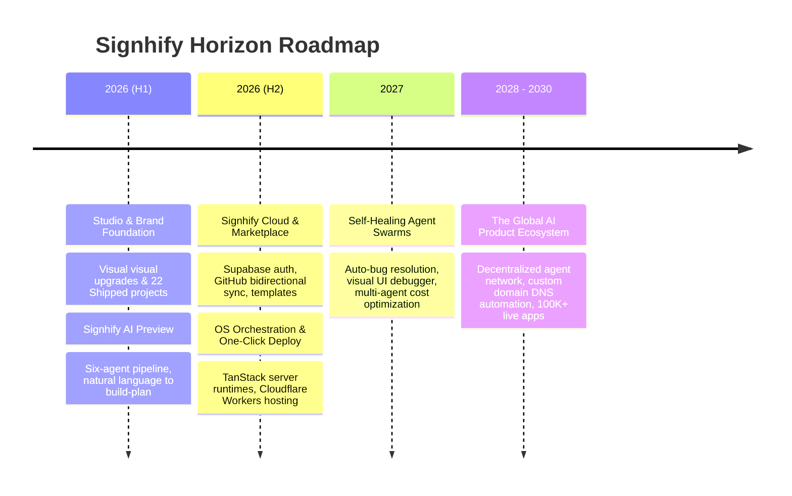

# Signhify — The Final Level Roadmap (2026 - 2030)

> **Vision**: Signhify is the ultimate AI-native product studio and operating system. We enable founders, creators, and enterprises to turn ideas into production-ready, revenue-generating software in minutes through steering autonomous agent swarms.

This is the comprehensive, multi-phase master plan to scale Signhify from an elite AI-native development studio into a global decentralized software engine.

---

## 🗺️ High-Level Horizon View

---

## 🚀 Phase 1: Studio & Brand Foundation (Completed)
**Focus**: Establishes Signhify as a trusted premium studio showcasing actual shipped builds with high-fidelity, high-aesthetic branding.

* **Milestones**:
  - [x] **22 Shipped Projects Portfolio**: Completed audit and addition of 22 real Vercel deployments (SaaS, AI automation, EdTech, Performance Marketing).
  - [x] **Premium Visual Identity**: Implemented dark cinematic theme (near-black background with electric orange glow and gold/amber accents).
  - [x] **High-Res Assets**: Generated matching premium custom hero and service banner images.
  - [x] **Lead Capture Engine**: Integrated Supabase-backed contact wizard, Calendly bookings, and WhatsApp quick action.

---

## ⚡ Phase 2: Signhify AI & Workspace OS (In Progress / Q3 2026)
**Focus**: Transitions from a static portfolio to an interactive AI playground where users get real build specs.

* **Key Deliverables**:
  - [ ] **AI Blueprint Generator (`/ai`)**: Allow users to type prompts and get a detailed Claude-generated execution plan.
  - [ ] **Six-Agent Pipeline UI**: Animate the compilation process (Schema Design, Design Tokens, Code Gen, Test Suite, Deploy Setup) in real-time.
  - [ ] **Supabase Auth Integration**: OAuth brokers (Google, GitHub) + email sign-in.
  - [ ] **Waitlist Engagement**: Automated double-opt-in workflows using Resend.

---

## 📦 Phase 3: The Creator Marketplace & Templates (Q4 2026)
**Focus**: Empowers developers to sell code/templates and helps founders download starting blocks.

* **Key Deliverables**:
  - [ ] **Template Store (`/marketplace`)**: Listings for responsive templates, landing pages, and API configurations.
  - [ ] **Signed URL Asset Delivery**: Secure delivery of build packages stored in Supabase buckets.
  - [ ] **Stripe Checkout**: Seamless payment gateways for premium templates.
  - [ ] **Creator Console (`/marketplace/sell`)**: Onboarding workspace for independent designers and developers.

---

## ☁️ Phase 4: Signhify Cloud & One-Click Deploy (H1 2027)
**Focus**: Zero-config deployment and automated cloud infrastructure management.

* **Key Deliverables**:
  - [ ] **Cloudflare Workers & Pages Integration**: Instantly host static frontends and serverless backends.
  - [ ] **GitHub Bidirectional Sync**: Keep codebases synced between Lovable, Signhify, and GitHub repositories.
  - [ ] **Automated DNS & Domain Wizard**: One-click custom domain configuration.
  - [ ] **Built-in Secrets Vault**: High-security environment variables storage encrypted via AES-256.

---

## 🤖 Phase 5: Self-Healing Agent Swarms (H2 2027)
**Focus**: Upgrading AI agents from passive code builders to active maintenance swarms.

* **Key Deliverables**:
  - [ ] **Telemetry & Auto-Debugging**: Telemetry logs trigger AI repair swarms to fix runtime exceptions without human intervention.
  - [ ] **Visual UI Debugger**: Visual editor to click elements and prompt localized modifications.
  - [ ] **Cost & Budget Guard**: Strict token budget enforcement per run to prevent infinite loop loops.

---

## 🌐 Phase 6: Decentralized AI Product Ecosystem (2028 - 2030)
**Focus**: Decoupled, globally distributed agent swarm network scaling to hundreds of thousands of active deploys.

* **Key Deliverables**:
  - [ ] **Multi-Agent Orchestrator Registry**: Developers write custom agents that plug into Signhify OS.
  - [ ] **AI-to-AI Payment Rails**: Agents autonomously trade API resources and templates using secure stablecoins.
  - [ ] **Autonomous Growth Hacking**: Under-the-hood SEO and A/B test adjustments run by growth agents based on user analytics.

---

## 🎯 Key North-Star Performance Metrics

| Metric | Target (2026) | Target (2028) | Target (2030) |
| :--- | :--- | :--- | :--- |
| **Prompts to Live Deploys** | 10,000 | 250,000 | 2,000,000+ |
| **Active Shipped Projects** | 100+ | 5,000+ | 50,000+ |
| **Average Build-to-Preview Time** | < 90 seconds | < 45 seconds | < 15 seconds |
| **Self-Healing Resolution Rate** | N/A | 65% of exceptions | 90%+ of exceptions |
| **Net Promoter Score (NPS)** | ≥ 60 | ≥ 70 | ≥ 80 |

---

## 🛠️ Unified Tech Stack

* **Frontend & Routing**: TanStack Start + Vite + TailwindCSS
* **Interactive Dynamics**: Framer Motion + Three.js (3D cinematic particle canvas)
* **Backend Services**: TanStack Server Functions + Node.js
* **Database & Auth**: Supabase (PostgreSQL, RLS policies, OAuth)
* **AI Orchestration**: Lovable AI Gateway + Anthropic Claude 3.5 Sonnet / OpenAI GPT-4o
* **Infrastructure & Hosting**: Cloudflare Workers / Pages + GitHub Actions

---

*Last Updated: July 17, 2026 · Maintained by Piyush Raj Singh · [hello@signhify.online](mailto:hello@signhify.online)*
